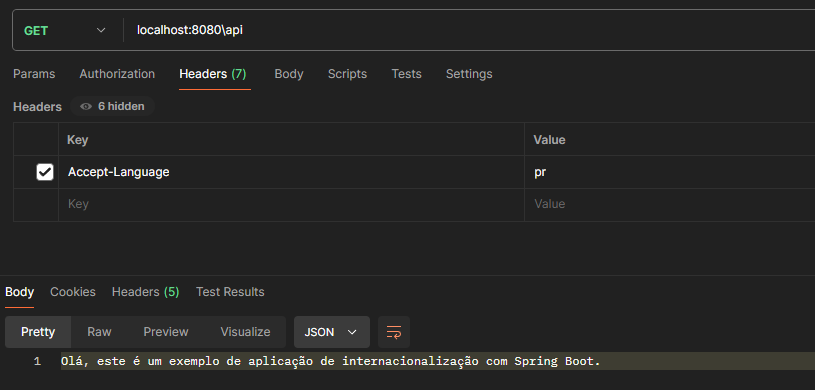
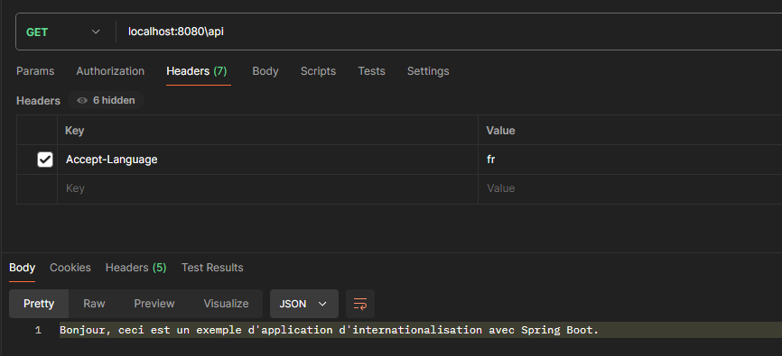

# spring-boot-i18n #

An example of how spring-boot works with internationalization i18n.

### How do I get set up? ###
* mvn clean install
* mvn spring-boot:run
* Call the API with postman http://localhost:8080/api
* The default language is English
* You can pass the Accept-Language in header with "fr" or "pr" value
* 
* 

### Contribution guidelines ###
* Rest-api
* i18n
